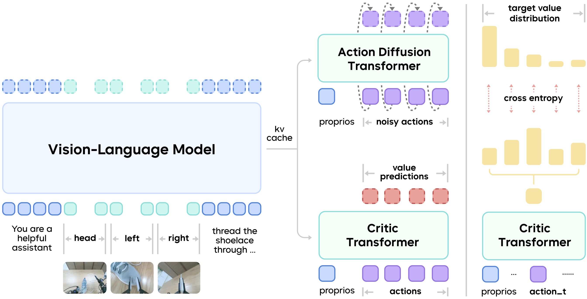

# Ben
Vision-enabled personal compute assistant

# Vision-Based autonomous personal compute assistant - Concept Flow

This document outlines the workflow and architecture:
- *Visually understands browser screens (images/video/audio)*
- *Acts in a browser (open tabs, fill forms & credentials, send emails)*
- *Uses automation frameworks*
- *Learns from user context and performs multi-step tasks autonomously*

---

## 1. Overview

1. **Observe** their environment through visual or structured input  
2. **Reason** about what to do next  
3. **Act** using tools (e.g., browser automation)  
4. **Repeat** until a high-level goal is achieved  

---

## 2. Browser Automation Workflow

### 2.1 Capture Layer

- Capture **screenshots** or screen *video frames* of the browser.
- Optionally capture **DOM snapshots** via browser APIs to enhance context.

This visual and structural data is sent to the perception model.

---

### 2.2 Perception & Understanding

Use vision-capable models to extract:
- UI element positions and labels
- Visible text and context
- Predicted interactive targets (buttons, forms)

The model outputs a structured understanding of what is visible.

---

### 2.3 Planning & Reasoning

A *planner module* uses the model’s interpretation to:
1. **Define goals** (e.g., “send an email”)
2. **Break goals into steps** (task decomposition)
3. **Decide on actions** (click, type, scroll)
4. **Handle loops and errors** (retry or fallback logic)

This can use frameworks like:
- Behavior trees
- Task decomposition techniques
- Model-based reasoning

---

## 3. Manus vs Ben (Vision Enabled Agent)

| Capability | Manus AI | Ben |
|------------|-----------|--------------------------------------------------------|
| Real-time screen capture | ❌ Not core | ✅ Core |
| Visually parse UI elements | ❌ Not main | ✅ Yes |
| Action automation in sandbox/cloud | ✅ Yes | ⚠ Only with custom tooling |
| Generates website code from visual context | ⚠ Limited/not specialized | ✅ Designed for it |
| Autonomous multi-step reasoning | ✅ Yes | Depends on agent linked |

### Unlike **Manus AI** which is more like a *cloud execution agent* focused on task automation using structured tools, Ben is a *vision-enabled compute agent (inspired from GR-RL Framework below cc. ByteDance) that watches a screen and acts directly*.

---
